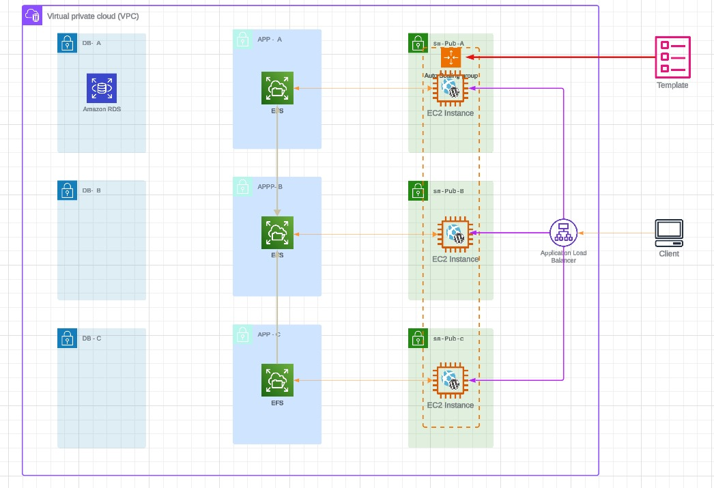

# Create the load balancer



* Move to the [EC2 console](https://console.aws.amazon.com/ec2/v2/home?region=us-east-1#Home:)
* open the [load balancer](https://us-east-1.console.aws.amazon.com/ec2/home?region=us-east-1#LoadBalancers:)
* Click Create **Application Load Balancer**
* **Name** : A4LWORDPRESSALB
* Ensure internet-facing is selected
* ensure ipv4 selected for IP Address type
* Under Network Mapping select **A4LVPC** in the VPC Dropdown
* Check the boxes next to **us-east-1a us-east-1b and us-east-1c**
* Select **sn-pub-A, sn-pub-B and sn-pub-C for each.** 
* Scroll down and under Security Groups *remove default* and select the **A4LVPC-SGLoadBalancer** from the dropdown.
* Under Listener and Routing Ensure Protocol is set to **HTTP** and Port is set to **80**.
* Click **Create target group** which will open a new tab
* **Target group name** : A4LWORDPRESSALBTG
* **Protocol** : HTTP
* **Port** : 80
* **VPC** : A4LVPC
* **Protocol Version** : HTTP1
* **Under Health checks** : ***/***
* ***Next***
* We wont register any right now so click **Create target Group**
* Go back to the previous tab where you are creating the Load Balancer Click the Refresh Icon and select the **A4LWORDPRESSALBTG** item in the dropdown.
* click **Create load balancer**
* select the load balancer you are creating.
* Scroll down and copy the DNS Name into your clipboard

# Create a new Parameter store value with the ELB DNS name
* Move to the [systems manager console](https://console.aws.amazon.com/systems-manager/home?region=us-east-1#)
* Click **Parameter Store**
* Click **Create Parameter**
* **Name** : /A4L/Wordpress/ALBDNSNAME 
* **Description** : enter DNS Name of the Application Load Balancer 
* **Tier** : Standard
* **Type** : String
* **DataType** : text
* **Value** : the DNS name of the load balancer you copied into your clipboard 
* Click Create Parameter

# Update the Launch template to wordpress is updated with the ELB DNS as its home

* Go to the [EC2 console](https://console.aws.amazon.com/ec2/v2/home?region=us-east-1#Home:)
* CLick **Launch Templates**
* Modify Template (Create New Version)
* **Template version description** : App only, uses EFS filesystem defined in /A4L/Wordpress/EFSFSID ALB home added to WP Database
* **Advanced Details**
* **User Data :**
    After ```#!/bin/bash -xe``` position cursor at the end & press enter twice to add new lines paste in this
    ```
    ALBDNSNAME=$(aws ssm get-parameters --region us-east-1 --names /A4L/Wordpress/ALBDNSNAME --query Parameters[0].Value)
    ALBDNSNAME=`echo $ALBDNSNAME | sed -e 's/^"//' -e 's/"$//'`
    ```
* Move all the way to the bottom of the **User Data** and paste in this block : 
```
cat >> /home/ec2-user/update_wp_ip.sh<< 'EOF'
#!/bin/bash
source <(php -r 'require("/var/www/html/wp-config.php"); echo("DB_NAME=".DB_NAME."; DB_USER=".DB_USER."; DB_PASSWORD=".DB_PASSWORD."; DB_HOST=".DB_HOST); ')
SQL_COMMAND="mysql -u $DB_USER -h $DB_HOST -p$DB_PASSWORD $DB_NAME -e"
OLD_URL=$(mysql -u $DB_USER -h $DB_HOST -p$DB_PASSWORD $DB_NAME -e 'select option_value from wp_options where option_name = "siteurl";' | grep http)

ALBDNSNAME=$(aws ssm get-parameters --region us-east-1 --names /A4L/Wordpress/ALBDNSNAME --query Parameters[0].Value)
ALBDNSNAME=`echo $ALBDNSNAME | sed -e 's/^"//' -e 's/"$//'`

$SQL_COMMAND "UPDATE wp_options SET option_value = replace(option_value, '$OLD_URL', 'http://$ALBDNSNAME') WHERE option_name = 'home' OR option_name = 'siteurl';"
$SQL_COMMAND "UPDATE wp_posts SET guid = replace(guid, '$OLD_URL','http://$ALBDNSNAME');"
$SQL_COMMAND "UPDATE wp_posts SET post_content = replace(post_content, '$OLD_URL', 'http://$ALBDNSNAME');"
$SQL_COMMAND "UPDATE wp_postmeta SET meta_value = replace(meta_value,'$OLD_URL','http://$ALBDNSNAME');"
EOF

chmod 755 /home/ec2-user/update_wp_ip.sh
echo "/home/ec2-user/update_wp_ip.sh" >> /etc/rc.local
/home/ec2-user/update_wp_ip.sh
```
* Click **Create template version**
* Click **View Launch Template**
* Click Actions and **select Set Default Version**
* Under **Template version select 4**
* Click **Set as default version**

# Create an auto scaling group

* Move to the [EC2 console](https://console.aws.amazon.com/ec2/v2/home?region=us-east-1#Home:)
* [auto scaling](https://us-east-1.console.aws.amazon.com/ec2/home?region=us-east-1#AutoScalingGroups:)
* **name** : A4LWORDPRESSASG
* Under Launch Template select **Wordpress**
* Under Version select **Latest**
* Scroll down and click **Next**
* For Network VPC select **A4LVPC**
* For Subnets select **sn-Pub-A, sn-pub-B and sn-pub-C**
* Click **next**

# Integrate ASG and ALB
* Check the Attach to an **existing Load balancer box**
* Ensure Choose from your **load balancer target groups** is selected.
* for existing load balancer targer groups select **A4LWORDPRESSALBTG**
* don't make any changes to **VPC** Lattice integration options
* Under **health Checks check** Turn on Elastic Load Balancing health checks
* Under Additional Settings check **Enable group metrics** collection within CloudWatch 
* Scroll down and **click Next**
* For now leave Desired **Mininum and Maximum at 1**
* For Scaling policies - optional leave it on None
* Make sure Enable instance scale-in protection is NOT checked
* Click **Next**
* We wont be adding notifications so **click Next** 
* Click **Add Tag**
* for Key enter Name and for Value enter **Wordpress-ASG** make sure Tag New instances is checked Click Next Click Create Auto Scaling Group
* Right click on **instances** and open in a new tab
* Right click **Wordpress-LT**, Terminate Instance and confirm.
* This removes the old manually created wordpress instance Click Refresh and you should see a new instance being created... Wordpress-ASG this is the one created automatically by the ASG using the launch template - this is because the desired capacity is set to 1 and we currently have 0

# Add scaling
* Move to the [AWS Console](https://console.aws.amazon.com/ec2/autoscaling/home?region=us-east-1#AutoScalingGroups:)
* Click **Auto Scaling Groups**
* Click the **A4LWORDPRESSASG** ASG
* Click the **Automatic SCaling** Tab
# SCALEOUT when CPU usage on average is above 40%
* Click Create **dynamic Scaling Policy**
* For policy type select **Simple scaling**
* for Scaling Policy name enter **HIGHCPU**
* Click **Create a CloudWatch Alarm**
* Click **Select Metric**
* Click **EC2**
* Click By **Auto Scaling Group** (if this doesn't show in your list, wait a while and refresh)
* Check **A4LWORDPRESSASG** CPU Utilization (if this doesn't show in your list, wait a while and refresh)
* Click Select **Metric**
* Scroll Down... select Threashhold style static, **select Greater and enter 40** in the than box and click Next Click Remove next to notification if you see anything listed here Click Next Enter WordpressHIGHCPU in Alarm Name
* Click **Next**
* Click **Create Alarm**
* Go back to the AutoScalingGroup tab and click the Refresh SYmbol next to **Cloudwatch Alarm**
* Click the dropdown and select **WordpressHIGHCPU**
* For Take the **action choose Add 1 Capacity units**
* Click **Create**
# SCALEIN when CPU usage on average is Under 40%
* Click Create **dynamic Scaling Policy**
* For policy type select **Simple scaling**
* for Scaling Policy name enter **LOWERCPU**
* Click **Create a CloudWatch Alarm**
* Click **Select Metric**
* Click **EC2**
* Click By **Auto Scaling Group** 
* Check **A4LWORDPRESSASG** CPU Utilization 
* Click Select **Metric**
* Scroll Down... select Threashhold style static, **select LOWER and enter 40** in the than box and click Next Click Remove next to notification if you see anything listed here Click Next Enter WordpressHIGHCPU in Alarm Name
* Click **Next**
* Click **Create Alarm**
* Go back to the AutoScalingGroup tab and click the Refresh SYmbol next to **Cloudwatch Alarm**
* Click the dropdown and select **WordpressLOWERCPU**
* For Take the **action choose remove 1 Capacity units**
* Click **Create**


# ADJUST ASG Values

* Click Details **Tab**
* Under Group **Details click Edit**
* Set Desired 1, Minimum 1 and **Maximum 3**
* Click **Update**


# FINISH 
