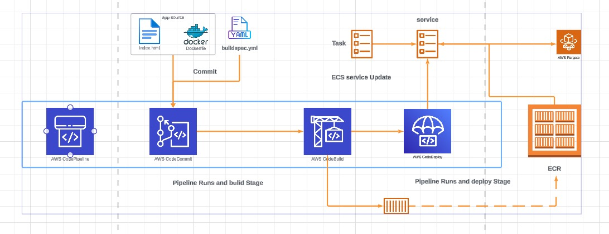

# to learn code pipelines

* [Configure SSH & Create a CodeCommit Repo](./codecommit.md)
* [Configure CodeBuild to clone the repo, create a container image and store on ECR](./CodeBuild.md)
* [Configure a CodePipeline with commit and build steps to automate build on commit.](./CODEPIPELINE.md)
* [Create an ECS Cluster, TG's , ALB and configure the code pipeline for deployment to ECS Fargate](./CODEDEPLOY.md)

