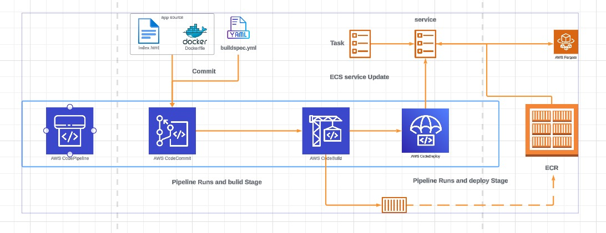

# CODE DEPLOY



## Configure a load balancer
* Go to the [EC2 Console](https://us-east-1.console.aws.amazon.com/ec2/v2/home?region=us-east-1#Home:) 
* Load Balancing -> Load Balancers -> Create Load Balancer.
* Create an application load balancer.
* NAME : **catpipeline**
* Internet Facing IPv4 For network, select your default VPC and pick ALL subnets in the VPC.
* Create a new security group (this will open a new tab) Call it `catpipeline-SG` and put the same for description Delect the default VPC in the list Add an inbound rule, select HTTP and for the source IP address choose `0.0.0.0/0` Create the security group.
* Return to the original tab, click the refresh icon next to the security group dropdown, and select **catpinepine-SG** from the list and remove the default security group
* Under listners and routing make sure **HTTP:80** is configured for the listner.
* Create a **target group**, this will open a new tab call it *catpipelineA-TG*, ensure that IP, **HTTP:80**, HTTP1 and the default VPC are selected.
* Click next and then **create the target group**, for now we wont register any targets.
* Return to the original tab, hit the refresh icon next to target group and pick **catpipelineA-TG** from the list.
* Then create the **load balancer**. This will take a few minutes to create, but you can continue on with the next part while this is creatign
## Configure a Fargate cluster
* Move to the [ECS console](https://us-east-1.console.aws.amazon.com/ecs/home?region=us-east-1#/getStarted) Clusters
* Create a Cluster.
* Move on, and name the cluster **allthecatapps** We will be using the default VPC so make sure it's selected and that all subnets in the VPC are listed.
* Create the cluster.
## Create Task and Container Definitions
* Go to the [ECS Cluster](https://us-east-1.console.aws.amazon.com/ecs/home?region=us-east-1#/clusters)
* Move to *Task Definitions* and *create a task definition*.
* NAME : **catpipelinedemo**.
* In Container Details : 
    * Name : **catpipeline**
    * **Image URI** move back to the ECR console and clikc *Copy URI* next to the latest image.
    * *click Next*
* **operating system family** : Linux/X86_64
* **task** : 0.5vCPU   
* **CPU** : 1GB for task memory.
* Select **ecsTaskExecutionRole** under task role and task execution role.
* Click Next and then Create. 
## DEPLOY TO ECS - CREATE A SERVICE
* Click Deploy
* **Launch type** : FARGATE
* **Service Name**: catpipelineservice
* **Desired Tasks** : 2 Expand Deployment Options
* **Deployment type** : rolling update
* Expand Networking.
* **VPC** : default VPC for Subnets make sure all subnets are selected. 
* Security Group : user Existing Security Group and ensure that Default and catpipeline-SG are selected.
* public IP : Turned On
* Load Balancer Type : Application Load Balancer
* Load balancer name : catpipeline
* container to load balance : **'catpipeline:80:80'**
* Use an existing Listener : 80:HTTP
* Use an existing target group 
* Target group name : catpipelineA-TG
* Expand Service auto scaling and make sure it's not selected.
* Click create
## TEST
* Move to the [load balancer console](https://us-east-1.console.aws.amazon.com/ec2/v2/home?region=us-east-1#LoadBalancers)
* Pick the **catpipeline load balancer**
* Copy the DNS name into your clipboard
* Open it in a browser, ensuring it is using ***http://*** not ***https://***
* You should see the container of cats website - if it fits, i sits 
## ADD A DEPLOY STAGE TO THE PIPELINE

* Move to the [code pineline console](https://us-east-1.console.aws.amazon.com/codesuite/codepipeline/pipelines?region=us-east-1) Click catpipeline then edit Click + Add Stage
* Call it Deploy then Add stage
* Click + Add Action Group
* name : Deploy
* Provider : Amazon ECS
* Region : US East (N.Virginia)
* Input artifacts : Build Artifact (this will be the imagedefinitions.json info about the container)
* Cluster Name : allthecatapps
* Service Name : catpipelineservice
* Image Definitions file : imagedefinitions.json
* Click Done Click Save & Confirm

## TEST

in the local repo edit the `index.html` file and add ` - WITH AUTOMATION` to the `h1` line text.  Save the file.  
then run

```
git add -A .
git commit -m "test pipeline"
git push
```
 
watch the [code pipeline console](https://us-east-1.console.aws.amazon.com/codesuite/codepipeline/pipelines/catpipeline/view?region=us-east-1)
make sure each pipeline step completes
Go back to the tab with the application open via the load balancer, refresh and see how the text has changed.  