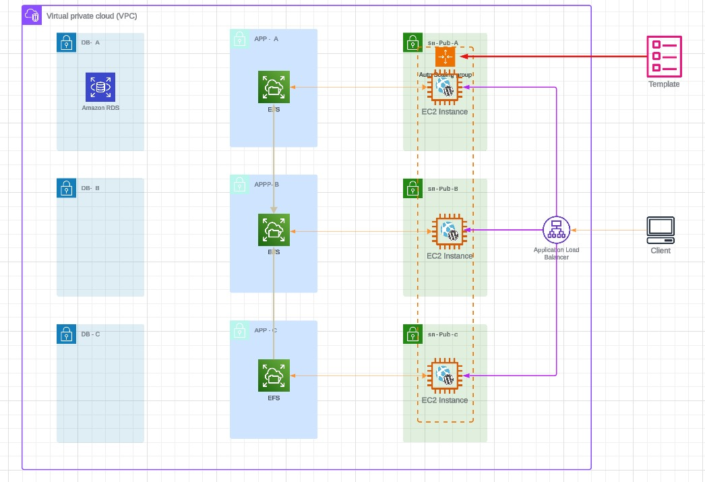

#  aws cloud infraucture 
 

## web app manually configured
 
This project is manual to configure a [web app](./manual_env.md) made by wordpress  

## EC2 template configuration

The [Templete](./first_templete.md) will still use the single instance for both the WordPress application and database, the only change will be an automatic build rather than manual.  

## creat a new database with RDS

you will be splitting out the database functionality from the EC2 instance .. running MariaDB to an [RDS instance](./RDS.md) running the MySQL Engine.

## ADD EFS filesystem

creating an [EFS file system](./EFS.md) designed to store the wordpress locally stored media. This area stores any media for posts uploaded when creating the post as well as theme data. By storing this on a shared file system it means that the data can be used across all instances in a consistent way, and it lives on past the lifetime of the instance.

## ASG + ALB add to the Project

you will be adding an [auto scaling group](./ASG+ALB.md) to provision and terminate instances automatically based on load on the system.

You have already performed all of the preparation steps required, by moving data storage onto RDS, media storage onto EFS and creating a launch template to automatically build the wordpress application servers
