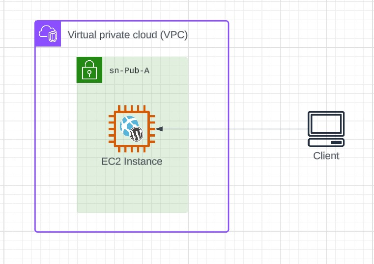
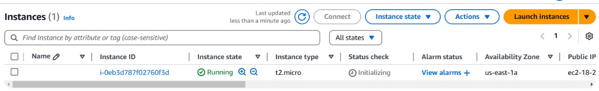

# Stage 1 - Setup the environment and manually build wordpress

## Login to an AWS Account

1 . login to your AWS account

2 . configure your  [VPC](https://us-east-1.console.aws.amazon.com/cloudformation/home?region=us-east-1#/stacks/quickcreate?templateURL=https://learn-cantrill-labs.s3.amazonaws.com/aws-elastic-wordpress-evolution/A4LVPC.yaml&stackName=A4LVPC)  

3 . Wait for the STACK to move into the CREATE_COMPLETE state before continuing.


##  Create an EC2 Instance to run Wordpress



Move to the [EC2 console](https://console.aws.amazon.com/ec2/v2/home?region=us-east-1)

**Name** : Wordpress-MAnual

**AMI** : Amazone Linux 2023

**Architecture** : 64-bit (x86)

**Instance type** : t2 or t3.micro cause Iam in Free tier

**Keypair** : Under Key Pair(login) select Proceed without a KeyPair (not recommended) I make it without key pair cause this project for practice only

**Network Settings** :  click Edit and in the VPC download select A4LVPC

**Subnet** : select sn-Pub-A

**Auto-assign public IP** : Enable

**Auto-assign IPv6 IP** : Enable

**security Group** : Select an existing security group --> A4LVPC-SGWordpress

**storage** : Defult

*open Advanced Details*

**IAM instance profile role** : A4LVPC-WordpressInstanceProfile

**Credit Specification** : Standard

```NOW Launch Instance```



## Create SSM Parameter Store

Storing configuration information within the SSM Parameter store scales much better than attempting to script them in some way

Open a new tab to [SSM](https://us-east-1.console.aws.amazon.com/systems-manager/home?region=us-east-1#welcome) 

Click on [Parameter Store](https://us-east-1.console.aws.amazon.com/systems-manager/parameters/?region=us-east-1&tab=Table) on the menu on the left

## Create Parameter - DBUser

*Click Create Parameter*

**Name** : /A4L/Wordpress/DBUser 

**Description** : Wordpress Database User

**Tier** : Standard

**Type** : String   

**Datatype** : text

**Value** : a4lwordpressuser

*click Create parameter*

## Create Parameter - DBName

*Click Create Parameter*

**Name** : /A4L/Wordpress/DBName 

**Description** : Wordpress Database Name

**Tier** : Standard

**Type** : String   

**Datatype** : text

**Value** : a4lwordpressdb

*click Create parameter*

## Create Parameter - DBEndpoint 

*Click Create Parameter*

**Name** : /A4L/Wordpress/DBEndpoint

**Description** : Wordpress Endpoint Name 

**Tier** : Standard

**Type** : String   

**Datatype** : text

**Value** : localhost

*click Create parameter*

## Create Parameter - DBPassword
*Click Create Parameter*

**Name** : A4L/Wordpress/DBPassword

**Description** : Wordpress DB Password

**Tier** : Standard

**Type** : SecureString

**KMS Key Source** : My Current Account 

**KMS Key ID** : as default (should be alias/aws/ssm).

**Value** : 4n1m4l54L1f3

*click Create parameter*

## Create Parameter - DBRootPassword

*Click Create Parameter*

**Name** : /A4L/Wordpress/DBRootPassword

**Description** : Wordpress DBRoot Password

**Tier** : Standard

**Type** : SecureString

**KMS Key Source** : My Current Account 

**KMS Key ID** : as default (should be alias/aws/ssm).

**Value** : 4n1m4l54L1f3

*click Create parameter*

##  Connect to the instance

1 . Right click on Wordpress-Manual choose Connect Choose Session Manager

2 . Click Connect

3 . type ```sudo bash``` and press enter

4 . type ```cd``` and press enter

5 . type ```clear``` and press enter

## Bring in the parameter values from SSM

**store values into ENV variables**

```
DBPassword=$(aws ssm get-parameters --region us-east-1 --names /A4L/Wordpress/DBPassword --with-decryption --query Parameters[0].Value)
DBPassword=`echo $DBPassword | sed -e 's/^"//' -e 's/"$//'`

DBRootPassword=$(aws ssm get-parameters --region us-east-1 --names /A4L/Wordpress/DBRootPassword --with-decryption --query Parameters[0].Value)
DBRootPassword=`echo $DBRootPassword | sed -e 's/^"//' -e 's/"$//'`

DBUser=$(aws ssm get-parameters --region us-east-1 --names /A4L/Wordpress/DBUser --query Parameters[0].Value)
DBUser=`echo $DBUser | sed -e 's/^"//' -e 's/"$//'`

DBName=$(aws ssm get-parameters --region us-east-1 --names /A4L/Wordpress/DBName --query Parameters[0].Value)
DBName=`echo $DBName | sed -e 's/^"//' -e 's/"$//'`

DBEndpoint=$(aws ssm get-parameters --region us-east-1 --names /A4L/Wordpress/DBEndpoint --query Parameters[0].Value)
DBEndpoint=`echo $DBEndpoint | sed -e 's/^"//' -e 's/"$//'`

```

**Install updates** : ```sudo dnf -y update```

**Install Pre-Reqs and Web Server** : 
```
sudo dnf install wget php-mysqlnd httpd php-fpm php-mysqli mariadb105-server php-json php php-devel stress -y

```
**Set DB and HTTP Server to running and start by default** :
```
sudo systemctl enable httpd
sudo systemctl enable mariadb
sudo systemctl start httpd
sudo systemctl start mariadb
```

**Set the MariaDB Root Password** : 

```
sudo mysqladmin -u root password $DBRootPassword
```

**Download and extract Wordpress** : 

```
sudo wget http://wordpress.org/latest.tar.gz -P /var/www/html
cd /var/www/html
sudo tar -zxvf latest.tar.gz
sudo cp -rvf wordpress/* .
sudo rm -R wordpress
sudo rm latest.tar.gz
```

**Configure the wordpress wp-config.php file** : 
```
sudo cp ./wp-config-sample.php ./wp-config.php
sudo sed -i "s/'database_name_here'/'$DBName'/g" wp-config.php
sudo sed -i "s/'username_here'/'$DBUser'/g" wp-config.php
sudo sed -i "s/'password_here'/'$DBPassword'/g" wp-config.php
```
**Fix Permissions on the filesystem** : 
```
sudo usermod -a -G apache ec2-user   
sudo chown -R ec2-user:apache /var/www
sudo chmod 2775 /var/www
sudo find /var/www -type d -exec chmod 2775 {} \;
sudo find /var/www -type f -exec chmod 0664 {} \;
```
**Create Wordpress User, set its password, create the database and configure permissions** : 

```
sudo echo "CREATE DATABASE $DBName;" >> /tmp/db.setup
sudo echo "CREATE USER '$DBUser'@'localhost' IDENTIFIED BY '$DBPassword';" >> /tmp/db.setup
sudo echo "GRANT ALL ON $DBName.* TO '$DBUser'@'localhost';" >> /tmp/db.setup
sudo echo "FLUSH PRIVILEGES;" >> /tmp/db.setup
sudo mysql -u root --password=$DBRootPassword < /tmp/db.setup
sudo rm /tmp/db.setup
```

## Test Wordpress is installed
Open the [EC2 console](https://console.aws.amazon.com/ec2/v2/home?region=us-east-1#Instances:sort=desc:tag:Name)


Select the ***Wordpress-Manual*** instance

copy the IPv4 Public IP into your clipboard (DON'T CLICK THE OPEN LINK ... just copy the IP) Open that IP in a new tab

*You should see the wordpress welcome page*

## Perform Initial Configuration and make a post

**Site Title** : enter Catagram

**Username enter** : admin in Password enter *4n1m4l54L1f3*

**Email** : entr your email address

**Install WordPress** : Click Log In

**Username or Email Address** enter admin

**Password** enter the *4n1m4l54L1f3*

***Click Log In***

1 . Click Posts in the menu on the left

2 . Select Hello World! Click Bulk Actions and select Move to Trash Click Apply

3 . Click Add New

4 . For title The Best Animal(s)!

5 . Click the + under the title, select Gallery Click Upload

6 . Select some animal pictures.... if you dont have any use google images 
to download some

7 . Upload them

8 . Click Publish

9 . Click Publish Click view Post

# The Project is manually created 

## The Outcomes is :


*This configuration has several limitations which you will resolve one by one within this lesson :-*

- The application and database are built manually, taking time and not allowing automation
- ^^ it was slow and annoying ... that was the intention.
- The database and application are on the same instance, neither can scale without the other
- The database of the application is on an instance, scaling IN/OUT risks this media
- The application media and UI store is local to an instance, scaling IN/OUT risks this media
- Customer Connections are to an instance directly ... no health checks/auto healing
- The IP of the instance is hardcoded into the database ....
- Go to [EC2 instance](https://console.aws.amazon.com/ec2/v2/home?region=us-east-1#Instances:sort=desc:tag:Name)
- Right click Wordpress-Manual , Stop Instance, Stop
- Right click Wordpress-Manual , Start Instance, Start
- the IP address has changed ... which is bad


- Right click Wordpress-Manual , Terminate Instance, Terminate


