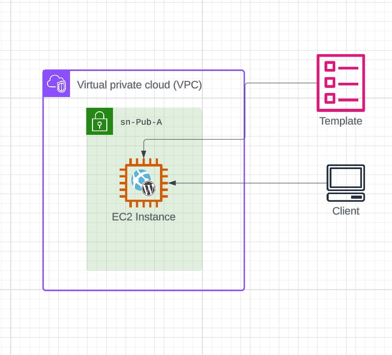

# Create the Launch Template



1. Open the [EC2 console]( https://console.aws.amazon.com/ec2/v2/home?region=us-east-1#Instances:sort=desc:tag:Name)
2. Click Launch Templates
3. Click Create Launch Template
 
**Launch Template Name** : Wordpress

**Template version description** : Single server DB and App

**AMI** : click Quick Start and Choose Amazon Linux Then choose Amazon Linux 2023 AMI and set the Architecture to 64-bit (x86)

**Instance Type** : Chose free tier eligible from either t3.micro and t2.micro

**Key pair (login)** : select Don't include in launch template

**Networking Settings** : select existing security group and choose *A4LVPC-SGWordpress* Leave storage volumes unchanged

**Advanced Details** :
* **IAM instance profile** : A4LVPC-WordpressInstanceProfile

* **Credit specification** : Standard

# Add Userdata

Enter the user data :
```
#!/bin/bash -xe

DBPassword=$(aws ssm get-parameters --region us-east-1 --names /A4L/Wordpress/DBPassword --with-decryption --query Parameters[0].Value)
DBPassword=`echo $DBPassword | sed -e 's/^"//' -e 's/"$//'`

DBRootPassword=$(aws ssm get-parameters --region us-east-1 --names /A4L/Wordpress/DBRootPassword --with-decryption --query Parameters[0].Value)
DBRootPassword=`echo $DBRootPassword | sed -e 's/^"//' -e 's/"$//'`

DBUser=$(aws ssm get-parameters --region us-east-1 --names /A4L/Wordpress/DBUser --query Parameters[0].Value)
DBUser=`echo $DBUser | sed -e 's/^"//' -e 's/"$//'`

DBName=$(aws ssm get-parameters --region us-east-1 --names /A4L/Wordpress/DBName --query Parameters[0].Value)
DBName=`echo $DBName | sed -e 's/^"//' -e 's/"$//'`

DBEndpoint=$(aws ssm get-parameters --region us-east-1 --names /A4L/Wordpress/DBEndpoint --query Parameters[0].Value)
DBEndpoint=`echo $DBEndpoint | sed -e 's/^"//' -e 's/"$//'`

dnf -y update

dnf install wget php-mysqlnd httpd php-fpm php-mysqli mariadb105-server php-json php php-devel stress -y

systemctl enable httpd
systemctl enable mariadb
systemctl start httpd
systemctl start mariadb

mysqladmin -u root password $DBRootPassword

wget http://wordpress.org/latest.tar.gz -P /var/www/html
cd /var/www/html
tar -zxvf latest.tar.gz
cp -rvf wordpress/* .
rm -R wordpress
rm latest.tar.gz

sudo cp ./wp-config-sample.php ./wp-config.php
sed -i "s/'database_name_here'/'$DBName'/g" wp-config.php
sed -i "s/'username_here'/'$DBUser'/g" wp-config.php
sed -i "s/'password_here'/'$DBPassword'/g" wp-config.php
sed -i "s/'localhost'/'$DBEndpoint'/g" wp-config.php

usermod -a -G apache ec2-user   
chown -R ec2-user:apache /var/www
chmod 2775 /var/www
find /var/www -type d -exec chmod 2775 {} \;
find /var/www -type f -exec chmod 0664 {} \;

echo "CREATE DATABASE $DBName;" >> /tmp/db.setup
echo "CREATE USER '$DBUser'@'localhost' IDENTIFIED BY '$DBPassword';" >> /tmp/db.setup
echo "GRANT ALL ON $DBName.* TO '$DBUser'@'localhost';" >> /tmp/db.setup
echo "FLUSH PRIVILEGES;" >> /tmp/db.setup
mysql -u root --password=$DBRootPassword < /tmp/db.setup
rm /tmp/db.setup


```
Ensure to leave a blank line at the end

Click **Create Launch Template**

Click **View launch templates**


# Launch an instance using it

1. Select the launch template in the list ... it should be called Wordpress
2. Select the launch template in the list ... it should be called Wordpress
3. Scroll down to Network settings and under Subnet select sn-pub-A
4. Scroll to Resource Tags click Add tag Set Key to Name and Value to Wordpress-LT Scroll to the bottom and click Launch Instance
5. Click the instance id 

# Test

1. Open the [EC2 console]( https://console.aws.amazon.com/ec2/v2/home?region=us-east-1#Instances:sort=desc:tag:Name)
2. Select the Wordpress-LT instance
3. copy the IPv4 Public IP and open it on new tab
4. You should see the WordPress welcome page

# Perform Initial Configuration and make a post
you will find it on [manual_env](./manual_env.md)

# FINISH


