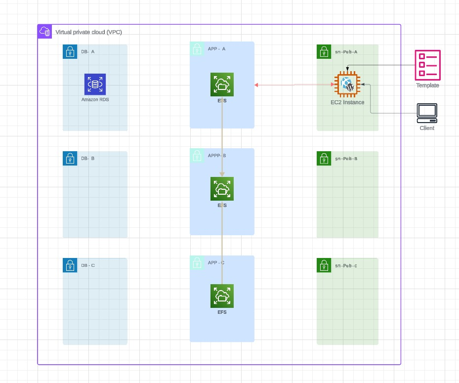

# Create EFS File System




* Move to the [EFS Console](https://console.aws.amazon.com/efs/home?region=us-east-1#/get-started)
* Create file System 
* Click on Customize
* **Name** : A4L-WORDPRESS-CONTENT
* **Storage Class** : Standard and ensure Enable Automatic Backups is enabled 
## for LifeCycle management : 
* **Transition into IA** : 30 days since last access
* **Transition out of IA** : None
* Untick Enable encryption of data at rest
* throughput modes choose Bursting
* Additional Settings : Performance Mode is set to General Purpose
* ***Next***

# Network Settings
In this part you will be configuing the **EFS Mount Targets** which are the network interfaces in the VPC which your instances will connect with : 

* **Virtual Private Cloud (VPC)** : A4LVPC
* Make sure us-east-1a, us-east-1b & us-east-1c are selected in each row.
* In *us-east-1a* row, select *sn-App-A* in the subnet ID dropdown, and in the security groups dropdown select **A4LVPC-SGEFS** & remove the default security group and make the same process for *us-east-1b* & *us-east-1c*
* **NEXT**

* Leave all these options as default and click next
* We wont be setting a file system policy so click Create
* The file system will start in the Creating State and then move to Available once it does..
* Click on the file system to enter it and click Network
* Scroll down and all the mount points will show as creating keep hitting refresh and wait for all 3 to show as available before moving on
* Note down the fs-XXXXXXXX or DNS name (either will work) once visible at the top of this screen, you will need it in the next step.

# Add an fsid to parameter store
Now that the file system has been created, you need to add another parameter store value for the file system ID so that the automatically built instance(s) can load this safely : 
* Move to the [Systems Manager console](https://console.aws.amazon.com/systems-manager/home?region=us-east-1#)
* Click on Parameter Store on the left menu
* Click Create Parameter
* **Name** : /A4L/Wordpress/EFSFSID
* **Description** : File System ID for Wordpress Content (wp-content)
* **Tier** : Standard
* **Type** : String
* **DataType** : text
* **Value** : set the file system ID fs-XXXXXXX which you just noted down
* **Create Parameter** 

# Connect the file system to the EC2 instance & copy data

*Open the [EC2 console](https://console.aws.amazon.com/ec2/v2/home?region=us-east-1#Instances:sort=desc:tag:Name)
* Select the **Wordpress-LT instance**, right click, Connect, Select Session Manager and click Connect
* type ```sudo bash```
* type ```cd``` 
* type ```clear``` 
* install the amazon EFS utilities 
```
sudo dnf -y install amazon-efs-utils
```
* next you need to migrate the existing media content from wp-content into EFS, and this is a multi step process.
* copy the content to a temporary location
```
cd /var/www/html
sudo mv wp-content/ /tmp
sudo mkdir wp-content
```
* get the efs file system ID from parameter store
```
EFSFSID=$(aws ssm get-parameters --region us-east-1 --names /A4L/Wordpress/EFSFSID --query Parameters[0].Value)
EFSFSID=`echo $EFSFSID | sed -e 's/^"//' -e 's/"$//'`
```
* get the efs file system ID from parameter store
```
echo -e "$EFSFSID:/ /var/www/html/wp-content efs _netdev,tls,iam 0 0" >> /etc/fstab
```
```
mount -a -t efs defaults
```
* now we need to copy the origin content data back in and fix permissions
```
mv /tmp/wp-content/* /var/www/html/wp-content/
```
```
chown -R ec2-user:apache /var/www/
```
# Test that the wordpress app can load the media

reboot the system 
```
reboot
```

# Update the launch template with the config to automate the EFS part

* Go to the [EC2 console](https://console.aws.amazon.com/ec2/v2/home?region=us-east-1#Home:)
* Click **Launch Templates**
* Check the box next to the **Wordpress launch template**
* click Actions and click **Modify Template (Create New Version)**
* **Template version description** : *uses EFS filesystem defined in /A4L/Wordpress/EFSFSID*
* Scroll to the bottom and expand Advanced Details
* Scroll to the bottom and find User Data expand the entry box as much as possible : 
    After ```#!/bin/bash -xe```

```
EFSFSID=$(aws ssm get-parameters --region us-east-1 --names /A4L/Wordpress/EFSFSID --query Parameters[0].Value)
EFSFSID=`echo $EFSFSID | sed -e 's/^"//' -e 's/"$//'`
```
Find the line which says 
```dnf install wget php-mysqlnd httpd php-fpm php-mysqli mariadb105-server php-json php php-devel stress -y``` 
after stress add a space and paste in ***```amazon-efs-utils```***

locate **```systemctl start httpd```**
paste in the following :
```
mkdir -p /var/www/html/wp-content
chown -R ec2-user:apache /var/www/
echo -e "$EFSFSID:/ /var/www/html/wp-content efs _netdev,tls,iam 0 0" >> /etc/fstab
mount -a -t efs defaults
```
* Click **Create template version**
* Click **View Launch Template**
* Click Actions and **select Set Default Version**
* Under **Template version select 3**
* Click **Set as default version**

# FINISH
